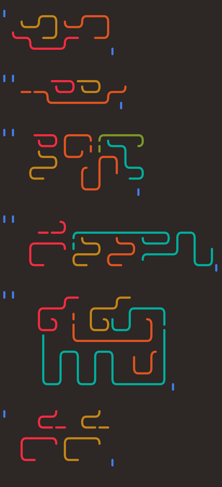

# Rivulet

Rivulet is a programming language of flowing strands, written in semigraphic characters. A strand is not pictographic: its flow does not simulate computation. There are four kinds of strands, each with their own symbolism and grammatical rules. Together, they form glyphs, tightly-packed blocks of code whose strands execute together.

Here is a complete Fibonacci program:
```
   ╵──╮───╮╭─    ╵╵╭────────╮
    ╰─╯╰──╯│       ╰─╶ ╶╮╶╮╶╯
   ╰─────╮ │      ╭─────╯ ╰─────╮
         ╰─╯ ╷    ╰───       ───╯╷

   ╵╵─╮  ╭─╮     ╭──       ╵╵╰─╮  ──╮──╮
      ╰─╮│ ╰─╯ ╵╵╰─╯╶╮       ╴─╯  ╭─╯╭─╯
      ╰─╯╰─ ╰──╯╰────╯       ╭╴ ╵╶╯ ╶╯╶╮
        ╭─╮ ╭╴               │  ╰──────╯
        │ │ │                ╰─╮       ╭─╮ 
      │ │ ╰─╯                  │     │   │
      ╰─╯            ╷         ╰──── ╰───╯╷

   ╵╵ ╭──  ──╮  ╭─╮         ╵╰─╮
      ╰─╮  ╭─╯╭─╯ │          ╴─╯
       ╶╯╵╶╯  │ ╷╶╯          ╭─╮
     ╭─╮ ╰────╯ │   ╭─╮        │
     │ ╰────╮ ╭─╯ ╭╴│ │      ╭─╯
     ╰────╮ │ │ │ │ │ │      │
     ╭────╯ │ │ ╰─╯ │ ╷      ╰─╷
     ╰────╮ │ ╰─────╯ │  
          │ ╰─────────╯╷
```

Here is the same program formatted by the interpreter into an svg, alongside two variations that produce equivalent computer instructions: 

Fibonacci 1 | Fibonacci 2 | Fibonacci 4
:-------------------------:|:-------------------------:|:-------------------------:
  |  | 

## Documentation
Alongside this introduction, you should find:
- [Tutorial](tutorial.md): The easiest way to get started
- [Syntax Reference](syntax.md)

## Table of Contents
- [Design Philosophy](#design-philosophy)
- [Data Model](#data-model)
- [Control Flow](#control-flow)

| :warning: WARNING          |
|:---------------------------|
| **Status: Version 0.4**. This is a mostly-working interpreter, and a tool to generate svg files of source code. The command list will likely need to expand for usability. |

## Design Philosophy

Rivulet is a list-based language that avoids ordinary approaches to branching and looping. Strands never split and no strand is left un-executed.

Its writing system was inspired by the satisfying compactness of mazes, Anni Albers's Meanders series, and space-filling algorithms. Its calligraphic aspects draw from natural language and favor the ability to write by hand.

## Data Model

In Rivulet, data is organized into lists of adjacent cells, populated with zeros by default. Commands are applied to either a single cell or an entire list. They take a second parameter, a constant or the value of another cell. 

Commands can also be run list-to-list, applying the command to each successive cell of one list, from the corresponding cells of the other. While these consider zero-populated cells as well, a list-to-list command ends at the last cell holding a value in either list.

The first list, List 1, is sometimes used as the output stream. This is an interpreter setting, as is whether they are displayed as numerical data or a Unicode string (where each value is rounded to the nearest integer).

## Control Flow

Every strand of every glyph runs in a Rivulet program; there is no equivalent of an "if" statement. If a glyph leads to an unwanted state, that glyph and the others of its block (all contiguous glyphs of the same level or higher), can be rolled back, setting the execution state to what it had been previously. The conditional rollback is the only form of branching in Rivulet. Loops only end with a rollback of their last iteration. Tests for rollback are that a single cell or an entire list is zero, indicated by a special set of strands called Question Strands.

Data strands are run in the order they begin at the top left, moving through each column flowing to the right. So the strand beginning at coordinate [2,0] is run, then [2,1], then [3,0], and so on. Question strands are always run after all data strands from the same glyph are executed.

